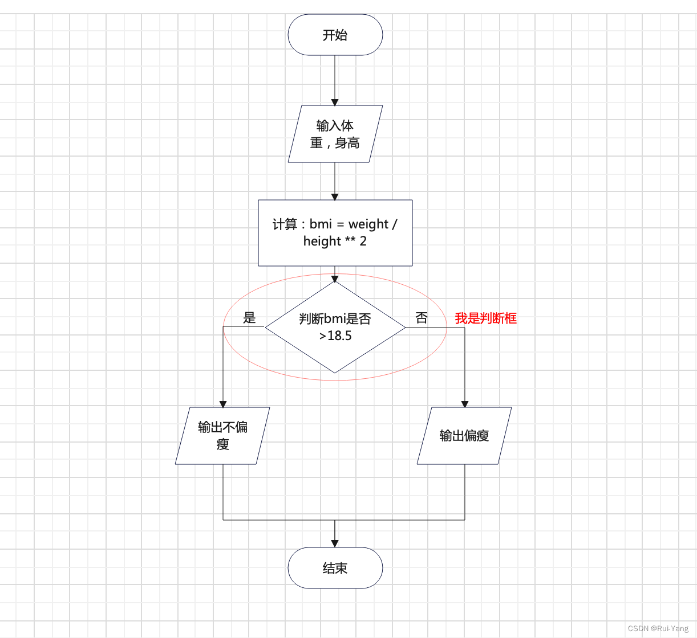
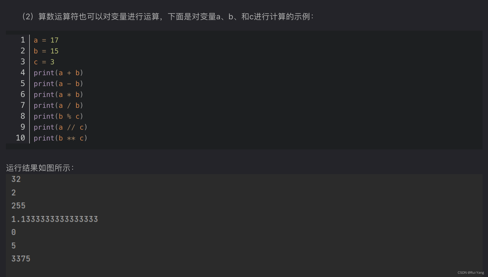
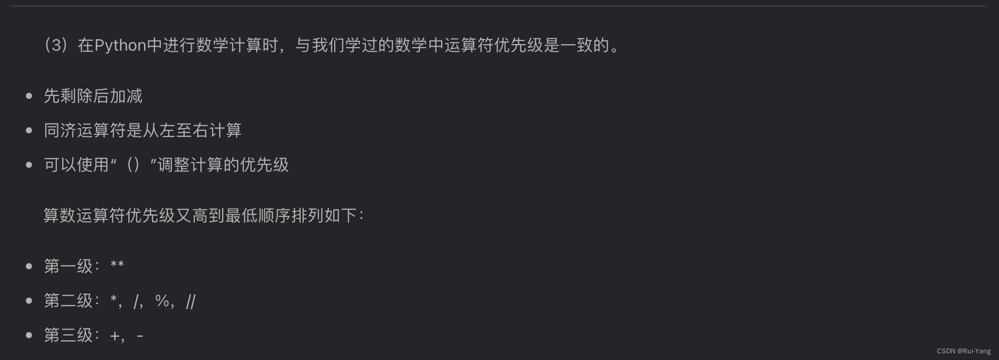

## 前言

`信息合格考python学习的路径`

在信息合格考中，Python的知识是比较多的。
在语言层面上，合格考的要求学习

 1. 变量命名，赋值，使用
 2. 认识各种数据类型
 3. 知道常用的数据组合形式，例如列表
 4. 使用常用的内置函数或方法
 5. 会使用math库或运算符进行数据计算
 6. 会使用顺序结构
 7. 会使用if-elif-else分支结构
 8. 会使用for和while循环
 9. 会遍历列表，操作列表，使用列表。


 以上9个语法大类。

---

在常用类库层面上，合格考要求学生简要了解常用的

 1. 数学库math
 2. 绘图库turtle
 3. 数据采集库requests
 4. HTML解析库BeautifulSoup
 5. 数据可视化库matplotlib
 6. 数据分析处理库Pandas
 7. 第三方数学库numpy
 8. 计算机视觉库pillow

以上8个类库的基本方法，函数作用，参数作用等。

---

此外，变成的周边技能也需要掌握，例如流程图，伪代码等。这些在本文都将全部以例题和实例的方式体现。

---

`提示：以下是本篇文章正文内容，从基础的编程周边开始`

# 一、流程图

> 流程图是由一些简单图形符号组成，用来表示问题解决步骤及顺序的方法。以下是常用流程符号。根据国标(GB1526-89)


---
## 1.1、起止框

此框用于表示程序的开始结束：


此框成对出现哦

---

## 1.2、处理框

表示需要处理的数据，初始化变量等需要做的事情：


就像此图中，它对我们输入的数据进行了计算，得出了一个结果bmi
ps：这个计算的方法又叫做算法哦

---

## 1.3、输入/输出框，I/O框

输入输出分别是两个英文单词，Input和Output，所以输入输出又称IO。
这个框表示数据的输入，或者是，结果的输出：


第一个输入框表示：输入两个数据，一个是身高，一个是体重。
经过处理框内的运算之后，得到了结果bmi。
第二个输出框表示：输出结果bmi让人看到，否则只是完成计算并没有写出来。

>这里举一个例子：
>       1， 老师给了你两个数字，一个1，一个2。
>        2，你经过心算后算出1+2=3
>        如果没有输出的话老师不知道你算出来的是多少所以我们要说出来
>        3，说出答案3
>        这里1就是输入框做的，3是输出框做的，这两个框一个代表输入一个代表输出。

---

## 1.4、判断框

判断框比哦啊是条件判断的情况，有True或False两种情况，如果满足条件为True，执行一条路径；不满足为False，执行另一条路径。这个框用于分支结构。



---

## 1.5、流程线，连接符

这个不多说了，流程线就是这些带箭头的线，从起点往指向运行。
连接符不常考，一个圆圈，认识就行。


自此流程图板块便结束了，这是为顺序结构，分支结构，循环结构打下了基础，在接下来学习结构的过程中，我们将非常频繁的使用到流程图，请大家复习掌握。

---

## 流程图例题

注意题中N代表NO否，Y代表YES是。


选项A，处理框初始化状态为正常 -> 判断框判断是否bmi大于23.9或bmi小于18.5，**用or（或）连接所以只要满足一个条件判断就为Y**，因为在23.9和18.5之间为正常，**所以只要满足一个，即条件判断为Y，状态就应该是“需注意”** -> 接下来发现错误点，如果满足的话应该输出不正常啊，但是它没有改变状态直接输出，所以A错误

选项B，处理框判断框与A相同，N和Y也反了一下对的，**但是注意，N的路径流程线跳过了输出框，这导致没有输出**，所以B不正确。

选项C，改正了B的错误，所以正确。

选项D，我们发现前面的逻辑都正确，**但是最后流程线会总多了一根没连接任何框的流程线，这对于流程图来说是错误的**，所以D错误。

---

***要点：流程图最后不能有没连接的流程线，要仔细看流程线的指向，有没有跳过某个框，要仔细梳理判断框条件的逻辑。***

---

# 二、算法结构
## 2.1、顺序结构

顺序结构就是没有分支，没有循环，自上向下运行的程序，即没有判断框（if-elif-else语句）没有重复的部分（for/while循环语句）
顺序结构的流程图一般是这样的，各种框任意组合，这个只是个例子：


---
## 2.2、分支结构

分支结构分为：

 1. 单分支
 2. 双分支
 3. 多分支

以上三种，我们一个个讲。

### 2.2.1、单分支

流程图是这样的：


也就是说只有一个步骤：满足了就做，不满足就不做
｜或者｜
不满足就做，满足了就不做
这两种。

---
### 2.2.2、双分支

流程图是这样的：


也就是：
如果条件成立->做一件事情
如果条件不成立->做另一件事情

---

### 2.2.3、多分支

流程图是这样的：


多分支就是：
如果第一个条件成立，那就做一件事情 -> 结束
如果第一个条件不成立，那就去第二个条件判断框看看成不成立。
分支可以有无限个，条件跟分支数量一样。

---


## 2.3、循环结构


输入一个数，如果小于等于10，那就重新输，如果不小于等于10，那就输出这个数。
循环结构一般有条件，如果满足条件就重新回到上面再执行一次（进入循环），不满足条件就跳出循环。

---

## 2.4、要点

> 结构一般与python的语句代码相关联，本章节希望好好理解逻辑，接下来的编程中会与结构相联系


---

# 三、Python语法

在本章节我们进行python语法层的学习，旨在完成前言中提到的9个语法大类的学习要求。

---

## 3.1、数据，数据类型

程序的作用是什么？程序的最关键的作用就是对生活中的各类数据通过算法进行计算，自动化，编码，等等操作，来方便人类的生活，那么我们生活中的数据有哪些呢？最常见的就是：

 1. 数字
 2. 文字

这两个可以说是最最重要数据了。之前学到过图像音频等信息也都是一串串二进制的数字而已。

---

### 3.1.1、int，float

在Python中，我们对于数字的数据类型有两种：

 1. int整型
 2. float浮点数型


```python
10 -> int
10.0 -> float
1.11 -> float
```


 int表示一个整数，float表示一个小数。

---

### 3.1.2、str

我们对于文字的数据类型有一种：

 - str字符串

字符串包裹在单引号或双引号内，例如：

```python
“Hello”
‘上海市复旦实验中学’
“1234:。。”
```
等等等等.....只要包含在引号里的就是字符串，不管它是数字还是符号还是什么妖怪。

---

### 3.1.3、bool

还记得我们判断框条件成立与否的True或False吗，还记得英语听力阅读的T或F吗？这些只有两个状态，即True或False（真或假）的数据就是bool，布尔值。

```python
True False
```
---

## 3.2、注释

我们的课本上通常会记笔记，比如说英语的这个单词是什么意思啦之类的，程序代码同样需要“笔记”，不然你自己最后也会忘记这行代码是干什么的，语法是这样的：

```python
# 井号后面的东西都是注释，电脑会无视你这句

```

---

## 3.3、变量

### 3.3.1、概念

刚刚我们认识了数据类型，但是光有数据没有容器不行啊，不然的话相当于泡的泡面没有桶，装不了啊。
这个时候就引入了变量的概念，我们把变量想象成一个盒子，每个盒子都有一个名字，里面装着的就是我们各种类型的数据。


---

### 3.3.2、变量命名规则

我们创建一个新的变量，也就是创建一个空的有名字的盒子，第一件事要干什么？肯定是想个名字啦，这个名字有一定的规则：

 1. **不能**是Python关键字
 2. **不能**以数字开头
 3. **只能**由数字，字母，下划线组成
 4. 程序内变量名**不能**重复

例如：

```python
num = 10 -> 正确
_num_123 = 1000 -> 正确
123num  = 10 -> 错误，以数字开头了
awsed&&22 = 10 -> 错误，里面有特殊符号
def = 10 -> 错误，有没有发现def字体颜色不一样，因为这是关键字！
```
python关键字：
这些都是不能当变量名字的哦

---

### 3.3.3、创建变量（赋值）

想好名字那就该给变量装东西啦，首先语法是这样的：

```python
#格式：name = value
#例子
a = 10 # int
b = 1.11 # float
c = "love" # str
d = True # bool
```
如果我们还没想好这个变量里面装什么数据类型的值呢？
也就是说我们光想要个空盒子，那就给一个None，None是Python关键字之一，它的英文翻译就是空的，什么都没有的，在python中也一样：

```python
variable = None
```
variable是变量的意思，这个时候variable这个变量就是一个空值，即空盒子。

---

### 3.3.4、使用变量

我们使用变量实际上就是想要用变量盒子里那个数据了，我们用的时候直接叫变量名字就可以了。

```python
msg = "Hello"
print(msg) # 打印出msg这个变量里面装的值
```
print函数我们在后面会讲，现在我们知道它是用来输出东西的就可以，就是把数据打印出来给你看。

---

## 3.4、运算符

我们在之前已经理解了变量的概念，会了如何使用变量，那么我们现在来学一下怎么对数据或变量进行运算。

---

### 3.4.1、算数运算符

#### 3.4.1.1、符号


Python2与Python3的 ‘/’ 运算符是有一些差别的，也就是Python2.x的版本和Python3.x的版本，合格考使用的版本是Python3.7，在这里说一个Python3以上基本没有大差别，不用过于纠结版本。


 - 在Python2中，除数与被除数至少有一个为float也就是小数则返回值为float
 - 在Python3中，不论除数与被除数是否为float返回值都自动转换为float

---
#### 3.4.1.2、变量间运算


---
#### 3.4.1.3、运算优先级


---
#### 3.4.1.4、不同数据类型间运算符作用

算数运算符都可以在int和float数据类型下任意组合使用，也就是例如：

```python
sum = 1 + 1
sum1 = 1 + 1.0
...
```
此外，字符串也可以使用 + *等运算符：


```python
string = “hel”
string2 = “lo”
string3 = string + string2
print(string3)
输出：
Hello
```

---
#### 3.4.1.5、常见报错
##### 3.4.1.5.1、ZeroDivisionError


除数为0是不允许的

---

##### 3.4.1.5.2、TypeError

我们出现这个报错大概率是因为字符串与整形或浮点数型发生了运算：

> TypeError: unsupported operand type(s) for +: 'int' and 'str'

一般报错就是这样的，翻译一下就是，不支持int跟str之间使用+运算。其他符号也一样。
例如这段代码就会发生这样的报错：
```python
num = 1 # int
str_num = "1" # str
sum = num + str_num
print(sum)
```
这是因为虽然str_num也是1，但是它是在引号内的，所以它的数据类型是字符串，是不可以跟int的数字直接运算的。

解决方法在下文会讲到，就是使用类型转换函数。

---

### 3.4.2、赋值运算符


应用实例：

```python
a = 1
b = 2
c = 3

a = a + b  # a+b的值赋值给a，此时a值为3
print(a)

a += b  # a = a+b,此时a值为5
print(a)

a -= b  # a = a-b,此时a值为3
print(a)

a *= b  # a = a*b,此时a值为6
print(a)

a /= b  # a = a/b,此时a值为3.0
print(a)

a %= b  # a = a%b,此时a值为1.0
print(a)

a **= c  # a = a**c,此时a值为1.0
print(a)

a //= b  # a = a//b,此时a值为0.0
print(a)

```
输出：


---

### 3.4.3、比较运算符


每一个比较的表达式都会返回True或False：

```python
a = 10
b = 9
print(a == b) # False
print(a != b) # True
print(a > b) # True
print(a < b) # False
...
```

---

### 3.4.4、逻辑运算符


例子：

```python
a = 10
b = 9
print(not a == b) # True，a==b本来返回False，前面又个not就反了一下，双重否定变肯定
print(a == b and a > b) # False, a==b不成立，and有一个不成立就返回False
print(a == b or a > b) # True, a > b成立，or有一个成立就返回True，两个都成立也返回True
```

---

### 3.4.5、位运算符

考试不考，了解一下：


---

## 3.5、python常用函数/方法

### 3.5.1、函数概念

假如你在做饭，函数就相当于厨房里的电器，你要做米饭，就往电饭煲里放水跟米，然后按一下，电饭煲就把你放的水跟米变成了米饭还给你。函数也是一样的，在这个例子里，电饭煲就是函数，水跟米就是函数的参数，按一下就是调用函数的过程，返回来的米饭就是函数给你的返回值，或者是效果。
函数的一般格式：

```python
name(parameter，parameter2......) # 位置传参
```
还有可能会遇到这样的：

```python
name(para_name = parameter) # 关键字传参
```
这个比较高级，意思就是这个参数的名字给一个值。例如电饭煲要煮饭还是煮粥如果是饭，那就：

```python
电饭煲(米, 水, 模式=煮饭)
```
差不多就是这个意思。

---

### 3.5.2、print函数

print函数用于将数据打印在终端区，也就是把数据打出来给你看，是一个输出函数，它的参数有：

```python
print(*Object, sep, end.....)
```
一般我们只用第一个参数，也就是变量或者数据都可以往里传，多个也可以结合

```python
print(1) # 输出：1
a = 1
a += 1
print("a = ", a) # 输出：a = 2
```
也可以直接传表达式：

```python
print(1 + 1) # 输出：2
a = 1
print(a += 1) # 输出：2
```

---

### 3.5.3、input函数

input函数里面接受一个字符串参数，默认返回一个str类型的值

```python
num = input("输入：")
print(num)
```
此函数会把input的参数先打印出来，然后你在后面输入任意字符，input接受并且返回，相当于你往里面放米，它返回给你饭，这个饭存在了num这个变量中。
输出：

```python
输入：2
2
```

---
### 3.5.4、类型转换函数，str(),int(),float()

我们之前在 3.4.1.4 讲运算符的时候说过，字符串跟int之间不能直接运算，而我们input输入的数字返回出来是str类型：

```python
num = input("输入数字：") # 这个是str类型的
sum = num + 1
print(sum)
```
此时出现报错TypeError，我们只要将输入进来的num转换成int在计算就好了，需要注意的是，字符串里面是输的是数字才能转，输文字不行。

```python
num = int(input("输入数字：")) # int()将str转为int类型
sum = num + 1
print(sum)
```
这里以int()举例，其他的str()float()是一样的道理。

---

### 3.5.5、round函数

round函数用来取小数点后n位，返回取后的值：

```python
round(float, n)
```
例子：

```python
round(1.1111, 1) # 返回1.1
```


---
### 3.5.6、编程例题a

> 题目：计算采样频率为44.1kHz的双声道数字音乐的数据存储量。
> 公式：数据存储量 = 采样频率 x 量化位数 x 声道数 / 8 x 持续秒数（字节）

 1. 输入量化位数，声道数，持续秒数
 2. 计算数据存储量
 3. 输出数据存储量


代码：

```python
bit = int(input("输入量化位数："))
track = int(input("输入声道数："))
seconds = int(input("输入持续秒数："))

storage = round(44.1 * 1000 * bit * track / 8 * seconds, 1)
print("此歌曲空间占用为", storage, "bytes(字节)")
```
流程图：


小问题a：

请问这个程序是什么结构呀，答案可以打在评论区哦：
格式：a.xxx结构

---

### 3.5.7 len函数

len函数的名字就是length的缩写，表示长度，可以这么记忆，它参数常用的是一个字符串或者一个列表，它返回字符串的长度：

```python
string = "abcd"
length = len(string)
print(length) # 输出：4
```
或者列表的长度：（列表下面会讲）

```python
num_list = [1, 2, 3]
length = len(num_list)
print(length) # 输出：3
```

这个函数通常搭配range函数（下面会讲），或者是while循环使用，作用就是获取长度以确定循环的次数。

---

### 3.5.8 math库的函数

math库是内置数学库，我们要掌握其常用函，因为它是库，所以我们要进行导入：

```python
import math
```
之后就可以以这样的形式使用：

```python
math.ceil()
```
#### 3.5.8.1、 ceil()向上取整函数：

一个参数，参数为浮点数时则 ***向上取整***，为整数时***直接返回***，不做任何更改
```python
import math

num1 = 5.668
num2 = 5
print(math.ceil(num1))   # 结果为 6
print(math.ceil(num2))   # 结果为 5

```

---
#### 3.5.8.2、floor()向下取整函数：

一个参数，参数为浮点数时则 ***向下取整***，为整数时***直接返回***，不做任何更改

```python
import math

num1 = 5.668
num2 = 4
print(math.floor(num1))   # 结果为 5
print(math.floor(num2))   # 结果为 4

```

基本上意思就是舍弃小数部分。**ps：非官方！！！**

---

#### 3.5.8.3、factorial()阶乘函数

一个参数，数字必须为正整数或0，当为小数或负数时会报错ValueError，它返回参数的阶乘 （！）：

```python
import math
print(math.factorial(4))         # 4的阶乘为 24
print(math.factorial(5))         # 5的阶乘为 120
```

---

#### 3.5.8.4、 幂与对数函数（拓展）

有兴趣的看：


用法与之前的都一致。

---

#### 3.5.8.5、三角函数 （拓展）


用法与上文一致。

---

#### 3.5.8.6、 math库函数例题

> 输入一个数字，返回它的阶乘

```python
import math

num = int(input("输入："))
print(math.factorial(num))
```

我们知道每个函数是干什么的返回什么怎么用就可以了。

---

## 3.6、if-elif-else语句（分支结构）

### 3.6.1、单分支结构（单if）

流程图

不会的复习一下2.2哦。

我们看到，如果满足条件返回是也就是True，不满足返回否False，我们可以使用逻辑运算符和比较运算符来写条件，见3.4.3和3.4.4，它们这个表达式的值都是bool值（True或False）

我们看一下语法：

```python
a = 10
if a < 9:
	print(a)
```

这段代码没有任何输出，因为如果a < 9条件满足的话（True）则输出a，如果不满足（False）则程序结束。很显然10 < 9返回的是False。大家可以尝试自己画一下流程图。


---

### 3.6.2、双分支结构（if-else）

这次多了个条件不成立要做的事：


看一下语法：
```python
a = 10
if a < 9:
	print("a < 9")
else:
	print("a >= 9")

# 输出：a >= 9
```

流程图是这样的：


---

### 3.6.3、 多分支结构（if-elif-else）

这次多了第一个条件不成立之后所要判断的第二个条件：


语法：

```python
a = 10
if a < 10:
	print("a < 10")
elif a == 10: # 记住这样判断是否相等的比较运算符是两个等号！！！
	print("a = 10")
else:
	print("a > 10")

# 输出：a = 10
```

流程图：


***一定注意if和elif和else语句后面都要有冒号！！一定是中文的冒号！！！
比较的运算符是==，而不是=，经常会搞错！！***

### 3.6.4、 常见报错
看一下因为冒号中英文，冒号缺失，等号只写了一个的报错。

#### 3.6.4.1、 报错invalid character

这是因为写成了中文符号，冒号括号引号都有可能，反正就不能是中文的。


报错的内容：invalid character

---

#### 3.6.4.2、 报错invalid syntax

这个报错表示语法错误，红的在哪行哪行有问题，仔细看看有没有少符号，格式一不一样，缩进一不一样。


---

### 3.6.5、缩进

python使用缩进来分割代码块儿，一个缩进一般为4个空格，也可以点一下Tab：


例如这一段：

***冒号就表示开辟了一个新的代码块，代码层级，下一行就必定需要缩进。***
if-elif-else语句，if下有一个代码块，这里面的代码是if条件成立后要执行的，elif下也有一个代码块，else下也有一个代码块，但ifelifelse这三句的条件语句都是在同一层级的，观察红色标记2，这表示第二层级。


了解了代码层级，我们要注意每次编写ifelse语句，循环语句，把他们嵌套的时候，代码层级是非常重要的，否则将报错。

---

### 3.6.6、分支结构例题

>

代码：


流程图大家自己尝试画一画，如果我们已经熟练掌握上面的知识的话，我们是可以直接写出代码的。有任何不懂的地方请复习3.3.3 -- 3.4 -- 3.5.8.1 -- 3.6.3，如果代码出现报错查看3.6.4

---

## 3.7、列表

理论上来说应该先讲循环的，但是python的循环有一个range函数，它与列表的有密不可分的关系，可以说python循环的实现像是在遍历一个数字列表，每次循环判断i的值是否超出了列表的最大值，或最小值。如果超出则循环结束。所以我们先来说列表，再来说循环。

### 3.7.1、列表概念

列表是由各种数据类型的数据作为元素所组成的一个集合体，但它同一个元素可以出现无数次一样的。

```python
eg_list = [1, 2, 3, 1.0, "1", "Good", True]
#索引       0, 1, 2,  3 ,  4 ,    5  ,   6
```

列表元素有一个索引，表示这个元素在列表中的位置，把列表想象成储物格就可以了，索引由0开始，在这个例子中，第0个元素的值为1，数据类型为int。

### 3.7.2、操作列表

操作列表有一些常用的方法

#### 3.7.2.1、append方法

参数为一个元素，但是这个函数没有返回值，是一个方法，格式：

```python
列表名字.append(元素)
eg_list = [1, 2]
eg_list.append(3)
print(eg_list)
# 输出：[1, 2, 3]
```
作用就是在末尾增加一个元素

---

#### 3.7.2.2、insert方法

参数为一个索引和一个元素，也是一个方法，格式：

```python
列表名.insert(索引值, 新的元素)
eg_list = [1, 2]
eg_list.insert(1, 3)
print(eg_list)
# 输出：[1, 3, 2]
```
意思就是在索引为1的地方插入一个元素，也可以说把一个元素插入到对应索引值的元素前面，右边的元素就被挤开了，所以索引值都加1。


---

#### 3.7.2.3、remove方法

参数为一个元素的具体值，有很多个一样的就只删第一个，没有就会报错。

```python
列表名.remove(元素)
eg_list = [1, 2]
eg_list.remove(1)
print(eg_list)
# 输出：[2]
```
#### 3.7.2.4、常见报错

 1. remove的那个值没有的报错
 2. 参数传少了报错

#### 3.7.2.5、列表操作例题

> 此题来自模拟考
> 

在索引为2的元素前插入一个0，选择B

---

#### 3.7.2.6、index方法

这个方法的参数是一个字符串或整型，实际上是列表中元素的值，它返回这个元素的索引值。

```python
列表名.index(元素值)
```


---

### 3.7.3、range函数

range函数返回一个由数字组成的序列，参数是一个起始值，一个终值，一个步长。
步长和起始值不输入默认为1和0

```python
range(起始值, 终值, 步长)
range(3) # 生成的序列为[0, 1, 2],里面填的那个终值不算！
range(1, 4) # [1, 2, 3],但是里面填的起始值是算的。
range(1, 5, 2) # 步长就是两个数字之间相差几，这个为2，就是[1, 3]
range(5, 1, -1) # 负数步长就是从大到小倒序，[5, 4, 3, 2]
```
要注意的是range返回的是一个迭代器，这个属于python高级编程中的知识，我们不做探讨，但是我们如果想要用它的话一种是用for循环，一种是用list构造函数构造一个列表。直接输出是不行的，这里作为拓展。
例如我们想要创建一个由1-100组成的列表，一个一个打字要打一辈子，但是range就很快：
这里使用了list构造函数，他可以把range序列变成列表，也可以把字符串一个一个拆开变成列表，我们只讲第一个。
```python
num_list = list(range(1, 101))
print(num_list)
```
这样一个由1-100组成的列表就完成了。

---
#### 3.7.3.1、range例题

> 

将每个选项展开成序列
 1. [0, 1, 2, 3, 4, 5, 6] -> 7个
 2. [1, 2, 3, 4, 5, 6] -> 6个
 3. [0, 1, 2, 3, 4, 5, 6] -> 7个 ， 跟1一样的，步长不设置就默认为1
 4. [1, 2, 3, 4, 5, 6] -> 6个 ，跟2一样的，步长不设置就默认为1
 5. [7, 6, 5, 4, 3, 2] -> 6个，不会的见3.7.3
 6. [7, 6, 5, 4, 3, 2, 1, 0] -> 7个，不会的见3.7.3

知道选啥了不，答案自己选一下。

---

## 3.8、for循环，while循环（循环结构）

循环就是在某个条件成立的情况下，不断运行循环体内代码的语句。

---

### 3.8.1、for循环

for循环的本质是不断调用next()函数，以此进行迭代，那我们就可以知道可以结合之前提到的range函数返回的迭代器一起用了，但是这样的说法无比高级，我们要求比较低，直接这么理解就好了，首先看for循环基础形式：

```python
for 循环变量 in 序列:
	循环体
```
我们想循环3次可以这么写：

```python
for i in range(3):
	print(i)
```
这里我们知道range生成了一个[0, 1, 2]这个列表，for循环的循环变量i会从第0个元素一直取到最后一个，取完了之后就跳出循环。第一次循环i的值是0，第二次是1，第三次是2，然后列表没了就跳出了循环，在这个过程中我们把i打印了出来就可以验证。输出是这样的：

```python
0
1
2
```
如果是有起始值和步长的道理也是一样的。
规律的话就是range里只有一个参数n的话，那循环的次数为n，i从0开始到n-1跳出循环。
#### 3.8.1.1、遍历

for循环因为本质上是遍历操作，也就是从第0个元素取到最后一个，那么我们放到列表中或者字符串中也是可以这么操作的。

```python
name_list = ["DJY", "SRY", "ABC"]
for name in name_list:
	print(name)
```
这样的话我们就成功的吧列表中的元素一个一个打印出来了。
输出：

```python
DJY
SRY
ABC
```

这个变量也是可以进行运算的，跟普通变量一样用就行。

```python
num_list = [1, 2, 3]
for num in num_list:
	print(num ** 2)
```
上面这个程序就输出了1，2，3的平方
输出：

```python
1
4
9
```
---

### 3.8.2、while循环

while循环是一种当循环，就是说每次循环开始的时候判断while后面的条件是否成立，成立则循环，不成立则跳出循环。循环体内需要对用来实现条件判断的变量进行运算，否则就会进入死循环。即循环条件一直成立。
这个程序是while的一般形式：
```python
limit = 0
while limit < 10:
	print(limit)
	limit = limit + 1 # 每次把limit加上1，这个等价于limit += 1
```
这个程序里面以limit是否小于10为条件，条件通过就循环一次，打印limit并且加上1，那在循环10次之后limit就变成了10，循环也随之结束。
输出：

```python
0
1
2
3
4
5
6
7
8
9 # 打印出9之后limit变成了10，下一次循环的时候判断条件没通过，所以print函数也没运行，所以没有打印出10
```

---
### 3.8.3、for循环与while循环的区别

一般来说，for循环用于已经知道循环次数的循环，while循环用于不知道什么时候结束循环的循环，合格考对于while循环要求较低，我们理解原理即可。

---
### 3.8.4、循环例题

> 

g值为'country' 那么Music_list.index(g)就是2，这样可以排除bc
然后原来的列表是[0, 0, 1, 2]
append语句把2加在列表的最后面，所以选择A
D选项把2加在了最前面，是不对的。

---
### 3.8.5、枚举算法

1，枚举算法的定义：

在进行归纳推理时，如果逐个考察了某类事件的所有可能情况，因而得出一般结论，那么该结论是可靠 的，这种归纳方法叫做枚举法。
2，枚举算法的思想是：
将问题的所有可能的答案一一列举，然后根据条件判断此答案是否合适，保留合适的，舍弃不合适的。
3，使用枚举算法解题的基本思路如下：
（1）确定枚举对象、范围和判定条件。
（2）逐一枚举可能的解并验证每个解是否是问题的解。
4，枚举算法步骤：
（1）确定解题的可能范围，不能遗漏任何一个真正解，同时避免重复。
（2）判定是否是真正解的方法。
（3）为了提高解决问题的效率，使可能解的范围将至最小
5， 流程图


> 枚举算法就是把所有情况的列举出来的算法，效率比较低。但是逻辑简单，例题如下

#### 3.8.5.1、枚举算法例题


经典的鸡兔同笼问题：

```python
sum = 35
sumFoot = 94
for i in range(1, sum):
  chickFoot = i * 2
  rabbitFoot = (sum - i) * 4
  if chickFoot + rabbitFoot == sumFoot:
    print(i, sum - i)
```
这个用枚举的意思就是，一只鸡三十四只兔子看看符不符合94只脚，两只鸡三十三只兔子看看符不符合.......全部列举一遍，符和的输出出来。

---
# 四、Python库

## 4.1、库的概念，使用方法

终于我们已经学到了库的这个环节，我们这个环节的基础是对Python函数使用的方面有着深刻的了解。我们所谓的Python库，不是一个字面意思上的数据库，而只是一个或多个Python文件而已，里面有着别人帮你定义好的方法和函数，Python的优势也在于此。

使用方法：

> 我们在之前就使用过一个个库 -- math库，还记得它的使用方法吗？

```python
# 这是一段使用math库中的ceil向上取整函数的实例
import math

num1 = 5.668
num2 = 5
print(math.ceil(num1))   # 结果为 6
print(math.ceil(num2))   # 结果为 5

```
我们可以看到当我们使用库中的函数时，我们要在程序调用函数前import一下这个库，这个import故名思义，就是导入，所以说我们在使用库函数之前需要导入一下这个库。
再然后我们使用：

```python
库的名字.函数的名字() # 以此来调用库内的函数
```
---
### 4.1.1、import语句

我们在4.1简要的了解了import，我们在本小节细致的来讲一下。
首先，import的意思是导入，表示将一个Python文件导入到我们的这个程序之中，我们简要的理解就是：

> 在使用库中的函数前我们需要先import库格式如下。

```python
import 库的名字
```

> 在import之后，我们就可以使用 库的名字.函数的名字() 来使用函数了。

接下来我们将一下import语句的高阶用法(以下为拓展)：

> 我们如果直接光使用一个import导入了库，我们每次调用这个库里的函数的时候都得写一个 -- 库的名字.函数名（） 但是为了方便，我们有一种可以省略库的名字的导入方法。

```python
from math import * # 这样导入我们下面使用的时候就可以不写math.了

print(ceil(2.1))
```

> 还有一种就是定向导入，我们直接使用import导入或者from import *的话，是直接导入了整个库，这样的内存占用是很大的，我们可以只导入一个函数或者类（类与对象为Python面向对象高阶编程思想，我们在本文不讨论）这种导入适用于只用这个库里几个函数的时候

```python
from math import ceil # 定向导入
 
print(ceil(2.1))
```
---
## 4.2、turtle库

turtle库是一个Python的常用函数库，我们顾名思义叫海龟或者乌龟，它在一个x为横轴y为纵轴，原点在画布中心的直角坐标系内由函数控制滑行，留下印迹，转向等操作。接下来介绍一下基本方法，放几个例子

---

### 4.2.1、turtle库--画布（canvas）
`画布是我们海龟的绘图区域，我们可以设置其大小等基础属性：

```python
turtle.screensize(canvwidth=None,canvheight=None,bg=None)
canvwidth -- 正整型数，以像素表示画布的新宽度值

canvheight -- 正整型数，以像素表示画面的新高度值

bg -- 颜色字符串或颜色元组，新的背景颜色

例如：
turtle.screensize(800,600, "green") # 颜色字符串为颜色的英文
turtle.screensize(800, 600, (255, 255, 255)) # 颜色元组为RGB
turtle.screensize() #返回默认大小(400, 300)

```

看不懂代码参数的去3.5.1复习
还有一种setup方法，可以设置海龟出生的初始位置，为拓展，感兴趣的可以自己试一试：

```python
在这里插入代码片turtle.setup(width=0.5, height=0.75, startx=None, starty=None)
width -- 如为一个整型数值，表示大小为多少像素，如为一个浮点数值，则表示屏幕的占比；默认为屏幕的 50%

height -- 如为一个整型数值，表示高度为多少像素，如为一个浮点数值，则表示屏幕的占比；默认为屏幕的 75%

startx -- 如为正值，表示初始位置距离屏幕左边缘多少像素，负值表示距离右边缘，None 表示窗口水平居中

starty -- 如为正值，表示初始位置距离屏幕上边缘多少像素，负值表示距离下边缘，None 表示窗口垂直居中

例如：
import turtle

turtle.setup(500,500)
```
### 4.2.2、画笔（pen）

在画布上，默认有一个坐标原点为画布中心的坐标轴，坐标原点上有一只面朝x轴正方向小乌龟。这里我们描述小乌龟时使用了两个词语：坐标原点(位置)，面朝x轴正方向(方向)， turtle绘图中，就是使用位置方向描述小乌龟(画笔)的状态。没兴趣的知道一下就好，感兴趣的可以自己试试画画东西。

#### 4.2.2.1、画笔粗细，颜色和绘画快慢
```python
turtle.pensize(width=None)表示小乌龟运动轨迹的宽度(线条粗细) 
---------------
turtle.pencolor(*args)函数表示小乌龟运动轨迹的颜色
允许以下四种输入格式:
pencolor()# 这个就是返回一下笔现在是什么颜色的，不是设置颜色
返回以颜色描述字符串或元组 (见示例) 表示的当前画笔颜色
pencolor(colorstring) # 这里面填颜色的英文
设置画笔颜色为 colorstring 指定颜色描述字符串，例如 "red"、"yellow" 或 "#33cc8c"。
pencolor((r, g, b))
设置画笔颜色为以 r, g, b 元组表示的 RGB 颜色。
pencolor(r, g, b)
设置画笔颜色为以 r, g, b 表示的 RGB 颜色。
------------------
turtle.speed(speed=None)速度值从 1 到 10，画线和海龟转向的动画效果逐级加快。就是画的速度，满的你可以看到海龟慢慢爬
"fastest": 0 最快
"fast": 10 快
"normal": 6 正常
"slow": 3 慢
"slowest": 1 最慢
```

---

#### 4.2.2.2、画笔的移动


```python
注意：
turtle.left(-90) 相当于 turtle.right(90)。# 转弯的
turtle.seth(angle)也是转弯的，表示小乌龟启动时运动的方向。 是角度值。其中，0表示向东，90度向北，180度向西，270度向南；负值表示相反方向。
函数：
turtle.circle(radius, extent=None, steps=None) # 画圆的
参数：
radius – 一个数值：半径为正(负)，表示圆心在画笔的左边(右边)画圆；
extent – 一个数值 (或 None)：extent 为一个夹角，用来决定绘制圆的一部分。
steps – 一个整型数 (或 None)：做半径为radius的圆的内切正多边形，多边形边数为steps
```

---

#### 4.2.2.3、画笔的控制

要想画出印记得先落笔，停止也得抬笔，还有填充一大块，都在这里面了。


```python
turtle.write(arg, move=False, align=“left”, font=(“Arial”, 8, “normal”))
这个是用来写字的，给个例子：
turtle.write("我爱你", move=False, align=“left”, font=None)

arg --: 要书写的文本内容

move --: True/False 写完海龟动不动

align --: 字符串 “left”, “center” 或 “right” 往哪对齐

font --: 一个三元组 (fontname, fontsize, fonttype) 字体
```

---

#### 4.2.2.4、其他


---


### 4.2.3、实例

```python
from turtle import *
from random import *
from math import *
 
def tree(n, l):
    pd()
    t = cos(radians(heading() + 45)) / 8 + 0.25
    pencolor(t, t, t)
    pensize(n / 4)
    forward(l)
    if n > 0:
        b = random() * 15 + 10
        c = random() * 15 + 10
        d = l * (random() * 0.35 + 0.6)
        right(b)
        tree(n - 1, d)
        left(b + c)
        tree(n - 1, d)
        right(c)
    else:
        right(90)
        n = cos(radians(heading() - 45)) / 4 + 0.5
        pencolor(n, n, n)
        circle(2)
        left(90)
    pu()
    backward(l)
 
bgcolor(0.5, 0.5, 0.5)
ht()
speed(0)
tracer(0, 0)
left(90)
pu()
backward(300)
tree(13, 100)
done()

```

故意不放效果，自己尝试运行！！

---

## 4.3、requests库

### 4.3.1、URL，HTTP/HTTPS，网络请求简述
首先我们来介绍一下requests，这是一个可以用来加进行网络请求的库，什么是网络请求呢？这就要讲一下我们浏览网站的原理了。
我们知道我们要成功的浏览网站需要有两个设备，也就是我们的电脑和网站的服务器，我们的电脑使用浏览器通过互联网向网站发起请求，服务器接受到了之后就会发送一个数据包给你，这里面有网页源代码和很多数据等等，你的浏览器把这些代码渲染成了页面。这就是原理了。
> 那么知道原理，我们要会使用requests库要知道什么名词呢？
> 

 1. URL 统一资源定位系统（uniform resource locator;URL）是因特网的万维网服务程序上用于指定信息位置的表示方法。也就是像这百度的网址一样https://www.baidu.com，是网站的地址
 2. http/https 超文本传输协议（Hyper Text Transfer Protocol，HTTP）是一个简单的请求-响应协议。它指定了客户端可能发送给服务器什么样的消息以及得到什么样的响应。HTTPS （全称：Hypertext Transfer Protocol Secure），是以安全为目标的 HTTP 通道，在HTTP的基础上通过传输加密和身份认证保证了传输过程的安全性。也就是说这是一种大家都要遵循的标准。

以上这些就是我们需要知道的新概念啦，那么我们话不多说，直接上代码。

### 4.3.2、get()函数及实例

首先我们要了解一种请求叫get请求，这是众多请求类型的一种，顾名思义它是用来取得网页源代码的，也就是我们访问一个网页就会向网站发送get请求，请求回源代码然后浏览器渲染。我们使用requests来取得一下网页源码。

```python
import requests

# get函数返回一个对象，对象是一个抽象的概念，它有很多的属性
response = requests.get('https://www.baidu.com')
# 这个意思就是把这个对象的属性编码设置为utf-8
# 你可以近似理解为就是源代码不会有乱码
response.encoding = 'utf-8'
# response.text就是源代码的文本，你直接输出response就会成了输出这个对象。
print(response.text)

```

> 记住，请求回来真正的网页源码不是response，而是response.text哦！response是有很多其他属性的。

---

## 4.4、BeautifulSoup库

BeautifulSoup是一个功能强大的HTML解析库。我们要知道，首先，有一种技术叫做网络爬虫，也就是通过编程让程序自动的爬取网站的源代码和公开的信息，再对其进行数据清洗筛选，把有用的信息可视化或者给AI训练。实际上爬虫只能爬我们都看得到的东西，它的精髓在于可以量化。
那么，我们上一章讲了如何用requests库获取网页源代码，这个BeautifulSoup其实就是用来提取网页中我们想要的信息的，在我们了解怎么用之前，我们要新学习一门新的语言，叫做HTML。

### 4.4.1、 HTML简述

> HTML的全称为超文本标记语言，是一种标记语言。它包括一系列标签．通过这些标签可以将网络上的文档格式统一，使分散的Internet资源连接为一个逻辑整体。可以说明文字，图形、动画、声音、表格、链接等。


这些是一些概念，实际上HTML就是由一对对标签和标签里的东西组成的，例如：

```html
<!DOCTYPE html>
<html lang="en">
<head>    
  <meta charset="UTF-8">    
  <title>Title<title/>
<head/>
 
<body>
  <h1>这是一级标题<h1/>
  <h2>这是二级标题<h2/>
  <h3>这是三级标题<h3/>
  <h4>这是四级标题<h4/>
  <h5>这是五级标题<h5/>
  <h6>这是六级标题<h6/>
    
  <p>定义文本<p/>
   
  <p>随便字符<br/>《-换行符<p/>
<body/>
<html/>
```

那么这基本上就是HTML的基础了，我们要记住这些标签都是成对出现的，而且用于结束的那个标签需要有/反斜杠。

---
### 4.4.2、find()、find_all()、get_text()函数与text属性

这段代码是将requests和BeautifulSoup结合的例子，先获取源代码，再把这个代码解析掉：

```python
import requests
from bs4 import BeautifulSoup

response = requests.get('https://www.baidu.com')
response.encoding = 'utf-8'
# 将网页源代码转换成BeautifulSoup对象，这个不理解就背下来
soup = BeautifulSoup(response.text, 'html.parser')
# 通过BeautifulSoup对象的find方法，提取出第一个p标签的文本, get_text()方法可以提取出标签内的文本
text = soup.find('p')
print(text.get_text())
# 通过BeautifulSoup对象的find_all方法，提取出所有的p标签的文本，get_text()方法可以提取出标签内的文本
texts = soup.find_all('p')
for text in texts:
	print(text.get_text())
	# 上面的get_text()方法与直接输出text属性等价，也就是
	print(text.text)

```
find函数和find_all函数都举例在了代码里，他们两个的区别就是一个只返回第一个标签，而find_all，返回所有标签列表。：

> find(str) 和 find_all(str)
> 
>
函数的参数应该是一个字符串，p标签就是“p”以此类推。

---

### 4.4.3、select函数

select函数又称css选择器，可以选择一些HTML的div标签下的文本等，比如说标题一般来说就是title，所以说我们可以：

```python
text = soup.select('title')
# 然后输出其中的文本
print(text.text)
```

---

### 4.4.4、实例

给大家看一下百度主页的HTML：

```html
<!DOCTYPE html>
<!--STATUS OK--><html> <head><meta http-equiv=content-type content=text/html;charset=utf-8><meta http-equiv=X-UA-Compatible content=IE=Edge><meta content=always name=referrer><link rel=stylesheet type=text/css href=https://ss1.bdstatic.com/5eN1bjq8AAUYm2zgoY3K/r/www/cache/bdorz/baidu.min.css><title>百度一下，你就知道</title></head> <body link=#0000cc> <div id=wrapper> <div id=head> <div class=head_wrapper> <div class=s_form> <div class=s_form_wrapper> <div id=lg>  </div> <form id=form name=f action=//www.baidu.com/s class=fm> <input type=hidden name=bdorz_come value=1> <input type=hidden name=ie value=utf-8> <input type=hidden name=f value=8> <input type=hidden name=rsv_bp value=1> <input type=hidden name=rsv_idx value=1> <input type=hidden name=tn value=baidu><span class="bg s_ipt_wr"><input id=kw name=wd class=s_ipt value maxlength=255 autocomplete=off autofocus=autofocus></span><span class="bg s_btn_wr"><input type=submit id=su value=百度一下 class="bg s_btn" autofocus></span> </form> </div> </div> <div id=u1> <a href=http://news.baidu.com name=tj_trnews class=mnav>新闻</a> <a href=https://www.hao123.com name=tj_trhao123 class=mnav>hao123</a> <a href=http://map.baidu.com name=tj_trmap class=mnav>地图</a> <a href=http://v.baidu.com name=tj_trvideo class=mnav>视频</a> <a href=http://tieba.baidu.com name=tj_trtieba class=mnav>贴吧</a> <noscript> <a href=http://www.baidu.com/bdorz/login.gif?login&amp;tpl=mn&amp;u=http%3A%2F%2Fwww.baidu.com%2f%3fbdorz_come%3d1 name=tj_login class=lb>登录</a> </noscript> <script>document.write('<a href="http://www.baidu.com/bdorz/login.gif?login&tpl=mn&u='+ encodeURIComponent(window.location.href+ (window.location.search === "" ? "?" : "&")+ "bdorz_come=1")+ '" name="tj_login" class="lb">登录</a>');
                </script> <a href=//www.baidu.com/more/ name=tj_briicon class=bri style="display: block;">更多产品</a> </div> </div> </div> <div id=ftCon> <div id=ftConw> <p id=lh> <a href=http://home.baidu.com>关于百度</a> <a href=http://ir.baidu.com>About Baidu</a> </p> <p id=cp>&copy;2017&nbsp;Baidu&nbsp;<a href=http://www.baidu.com/duty/>使用百度前必读</a>&nbsp; <a href=http://jianyi.baidu.com/ class=cp-feedback>意见反馈</a>&nbsp;京ICP证030173号&nbsp;  </p> </div> </div> </div> </body> </html>
```
我们上一小节运行的代码结果为：

```cpp
关于百度 About Baidu 
 关于百度 About Baidu 
©2017 Baidu 使用百度前必读  意见反馈 京ICP证030173号   
```
可以看到，第一个find函数提取了第一个p标签，而find_all找取了所有，所以说要使用遍历把标签列表中的每一个值都输出出来。

---

## 4.5、Pandas库

pandas库是基于numpy库开发的更加简洁更加实用的数据处理清洗库，它有Datafram和series两种类型，我们可以通过Datafram直接创建类似表格的数据，用Series直接创建一个类似数组的数据，或者是可以使用read_csv方法直接读取表格文件，我们先来了解什么是csv。

### 4.5.1、csv文件简述

> 逗号分隔值（Comma-Separated Values，CSV，有时也称为字符分隔值，因为分隔字符也可以不是逗号），其文件以纯文本形式存储表格数据（数字和文本）。纯文本意味着该文件是一个字符序列，不含必须像二进制数字那样被解读的数据。CSV文件由任意数目的记录组成，记录间以某种换行符分隔；每条记录由字段组成，字段间的分隔符是其它字符或字符串，最常见的是逗号或制表符。通常，所有记录都有完全相同的字段序列。通常都是纯文本文件。建议使用WORDPAD或是记事本来开启，再则先另存新档后用EXCEL开启，也是方法之一。

总的来说csv文件就是一个由纯文本组成的表格，例如：


与excel不同的是，excel可以储存很多不同类型的制，excel文件的后缀是：

> .xls和.xlsx

---


### 4.5.2、read_csv()函数读取文件，输出数据

我们可以通过read_csv()方法读取csv文件：

```python
import pandas as pd
df = pd.read_csv('example.csv')   # 读取csv文件 
```
之后如果我们想输出某一列的数据，例如：


想取出标记的这一列可以这样：

```python
print(df['制造商'])     # 输出制造商这一列的数据
print(df.ix[:, 1])       # 输出第二列数据（下标是从0开始的
print(df.iloc[:, 1])   # 输出第二列的数据但是只可以通过序列取，不能通过列名, (:表示所有行)
```
ps：

取出符号秉持着先行后列的原则，
**：** 这个符号代表所有行或者所有列，比如说[:]就代表着所有，[:, 1]就是所有行
的第二列的数据，那么就等价与第二列啦。

#### 4.5.2.1、数据筛选

我们输出数据的时候可能需要对数据进行筛选，比如说我们要输出这个表格年份大与1997的价值大于4900的数据：


也就是这个第三行数据，我们肯定不能自己筛选啊对吧，数据如果非常多那么就很累了，所以我们可以对某一个单元格的值进行判断，也就是：

```python
print(df[(df.ix['年'] >= 1997) & (df.ix['价值'] >= 4900)])  # 将年这一列大于1997且价值这一列大于4900的数据全部取出（与或非）
```
这就相当于进行了一个条件判断，使用：& 与，｜或，！非。这三种符号，其实就对应的是：and，or，not。csv的表头如果是中文的话可以使用ix函数筛选。

---

### 4.5.3、操作数据

#### 4.5.3.1、增删操作

想增加一列就：

```python
df['a'] = 1  # 添加a这一列的值全部为1，也可以让他等于一个列表，但列表的长度必须与行数相等
```
列表的话比如说我们这个表格有三行：

```python
df['a'] = [1, 2, 3]
```
想删除一列就：

```python
del df['a']  # 删除a这一列
```

---

#### 4.5.3.2、drop_duplicates去重函数

我们的表格中可能会有重复的值，比如说这两行的年份就是一样的：


我们如果不想要有一样年份的数据我们就可以使用去重函数。去重函数一共有三个常用参数：

```python
df.drop_duplicates(subset, keep, inplace) 
```

 - subset就是列名
 - keep就是保留行
 - inplace就是是否在原数据上操作

我们想去掉1999年的重复值，保留第一行的数据那么就可以这样：

```python
df.drop_duplicates(subset=['年份'], keep='first', inplace=False)  # 删除年份这一列重复的行, inplace=False表示在不在原数据上进行操作，默认是False
```
inplace=False表示在不在原数据上进行操作，默认是False

---
#### 4.5.3.3、dropna去空值函数

有的表中是有空的值的，例如这两行就是有空值的：


去空值函数有着这几个参数：

```python
df.dropna(axis, how, inplace)  # how='any'表示只要有空值就删这一行，'all'就是全部都为空值才删, axis=0表示行，axis=1表示列，inplace表示是否在原表操作
```

 - how='any'表示只要有空值就删这一行，'all'就是全部都为空值才删,
 - axis=0表示行，axis=1表示列，默认为0
 - inplace表示是否在原表操作，默认为False

我们要进行去重行上有空值的就可以这样：

```python
df.dropna(axis=0, how='any', inplace=False) 
```
---


# 总结
未完待续～
在合格考试复习阶段或者正在学习信息这门科目都可以看我的文章，Python学习讲究深入浅出，多动脑多思考，合格考不用愁！

